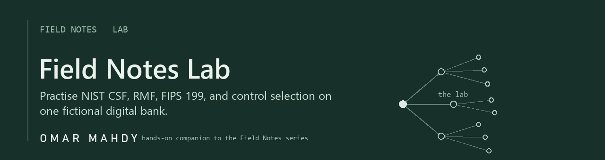

# Field Notes Lab

A hands-on companion to the Field Notes series. You read the article, then you come here and actually do it: categorise a system, build a Cybersecurity Framework profile, walk a system through the Risk Management Framework, and track the gaps, all on one fictional company you can practise on freely.

If the articles are the map, this is the terrain.

> **Everything here is fictional.** Meridian Pay is a made-up digital bank invented for teaching. The policies, systems, diagrams, and data are examples to learn from, not real security advice for any real organisation. The NIST structure (the Cybersecurity Framework, FIPS 199, the Risk Management Framework, the SP 800-53 families) is real; the company is not.

## Start here

1. **Meet the company.** Read the [company profile](company/00-company-profile.md), skim the [system inventory](company/01-system-inventory.md) and [data classification](company/02-data-classification.md), and look at the [architecture diagram](company/diagrams/architecture.png). Fifteen minutes, and everything afterwards will make sense.
2. **Then follow the episodes below in order.** Each one pairs with a Field Notes article and gives you something to open, fill in, and keep.

## The lab, episode by episode

The lab is released in step with the articles. Each episode appears here when its article is published, so nothing is spoiled ahead of time.

| Episode | You will | Status |
|---|---|---|
| 1. The CSF profile | Rate where Meridian is and where it wants to be, across all 22 CSF categories | Live: [episode-01-csf](episode-01-csf/README.md) |
| 2. The RMF, one system | Walk the Customer Web Portal through all seven RMF steps | Coming soon, with the article |
| 3. Categorize and Select | Categorise the portal (FIPS 199) and pick its controls | Coming soon, with the article |
| Ongoing | Track weaknesses to closure, assess controls, plan the roadmap | Live: [templates](templates/README.md) |

Most workbooks come in two versions: a **worked example** (see what "done" looks like) and a **BLANK** (the one you fill in). The hands-on episodes (1 and 3) also ship a **solution walkthrough** that explains the reasoning, so you can check not just your answer but how you got there. Episode 2 is a guided read-through of the RMF rather than a fill-in exercise.

## What is inside

```
field-notes-lab/
  company/                     the fictional bank: profile, systems, data, diagrams
  policies/                    five example security policies, each mapped to NIST
  reference/                   real NIST data: 800-53B baselines, the 20 families, sources
  episode-01-csf/              CSF 2.0 profile (worked + blank) + solution walkthrough
  templates/                   POA&M, gap assessment, and 800-53A control assessment
  (later episodes appear here as their articles publish)
```

## The policies

Five example policies, written for Meridian, each ending with how it maps back to the framework:

- [Information Security Policy](policies/01-information-security-policy.md) (the umbrella)
- [Access Control Policy](policies/02-access-control-policy.md)
- [Acceptable Use Policy](policies/03-acceptable-use-policy.md)
- [Data Classification Policy](policies/04-data-classification-policy.md)
- [Incident Response Plan](policies/05-incident-response-plan.md)

## Real NIST reference

So you are never far from the source, the lab ships the real NIST data it is built on:

- [reference/00-nist-sources.md](reference/00-nist-sources.md): the documents in play, and how they map to the episodes.
- **reference/sp800-53B-baselines.xlsx**: the real baseline sizes (Low 149, Moderate 287, High 370, Privacy 96) and the full Moderate baseline, all 287 controls, grouped by family. From NIST OSCAL.
- **reference/data/**: the machine-readable NIST source data, so you can verify or refresh it.
- **templates/control-assessment.xlsx**: assessing whether a control actually works, the SP 800-53A way (Examine, Interview, Test, then Satisfied or Other than satisfied), feeding the POA&M.

## How it all connects

The whole point is that these pieces are one loop, not separate exercises:

- The **CSF profile** tells you where your big gaps are.
- The **RMF** takes one system and gets it to an accountable sign-off.
- **Categorize** and **Select** are the two RMF steps where the real judgement happens.
- The **POA&M** tracks every weakness you find until it is closed.
- What you learn feeds back into the profile, and round it goes.

Do all of it on Meridian first. Then do it on a system you actually know. That second pass is where it stops being theory.

## Just open and use it

Everything here is ready to use. Open the Excel workbooks in Excel, LibreOffice, or Google Sheets. Read the Markdown pages on GitHub or in any text editor. There is nothing to install and nothing to build. Start at the company profile, then Episode 1.

## A note on sources

The NIST material referenced here is real and public: the Cybersecurity Framework 2.0 (CSWP 29), FIPS 199, the Risk Management Framework (SP 800-37 Rev. 2), and the SP 800-53 control families and baselines. The exact, normative wording always lives in the official documents at csrc.nist.gov. The plain-language descriptions in this lab are a teaching paraphrase, and the company they are applied to is invented.
